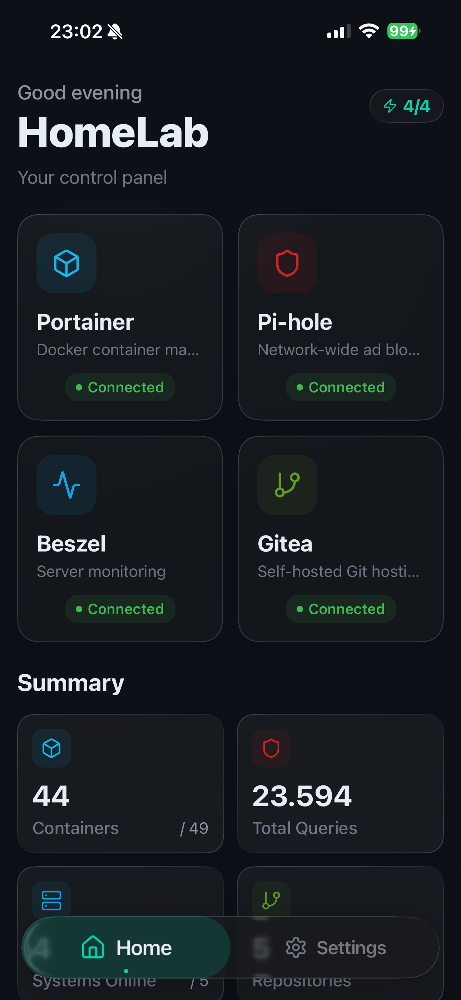
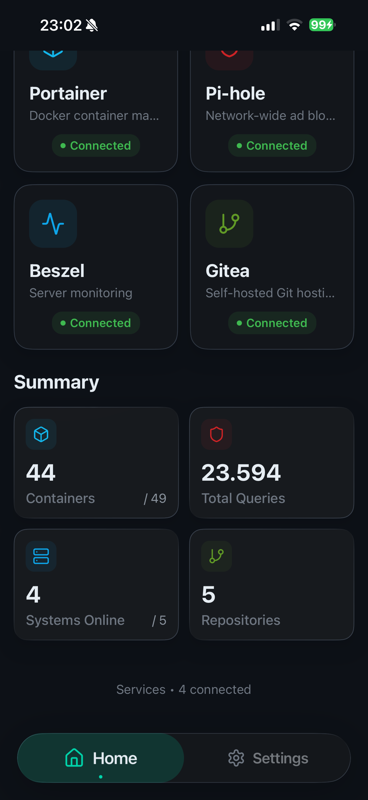
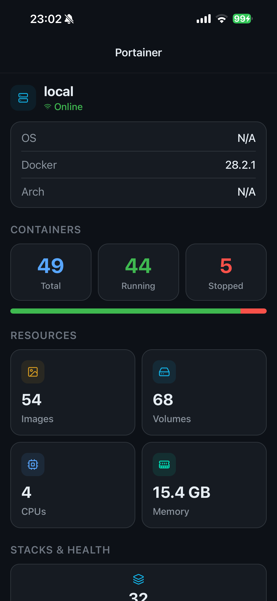
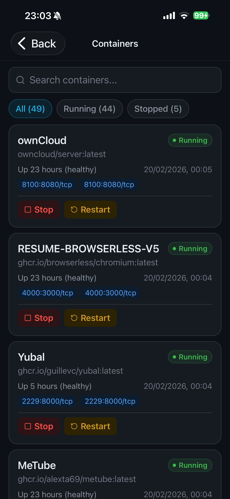
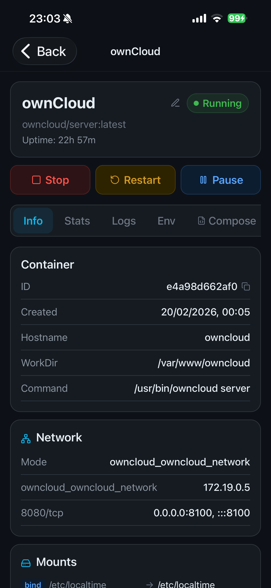
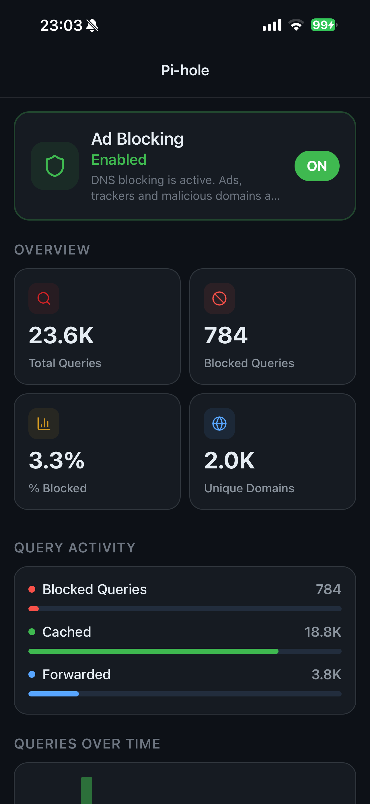
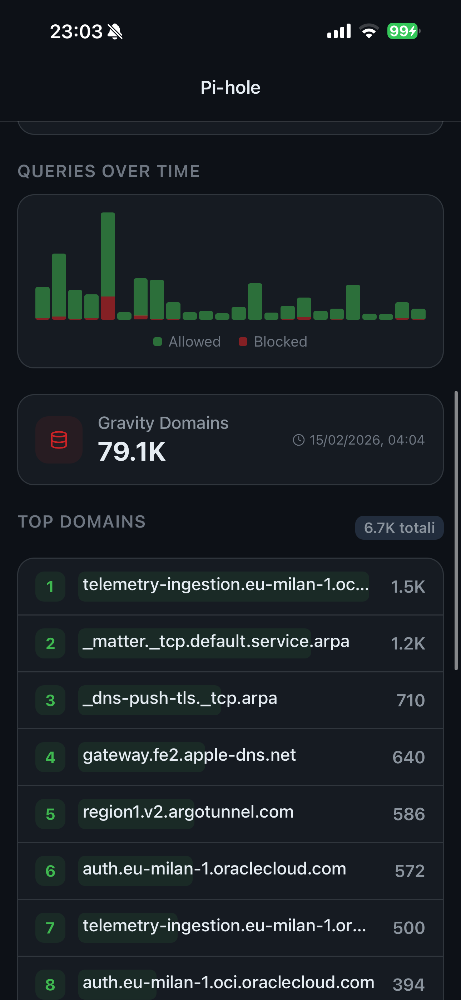
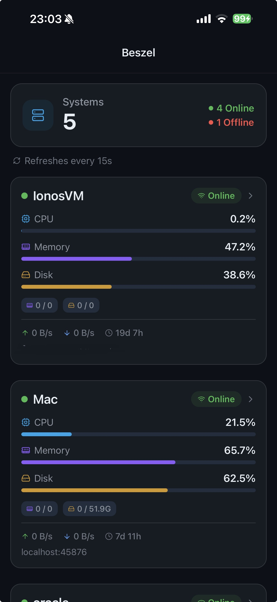
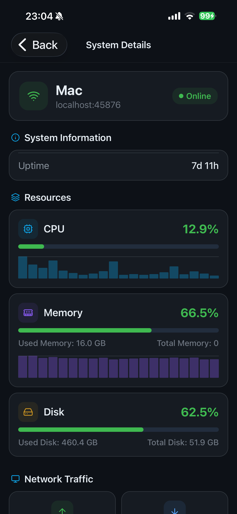
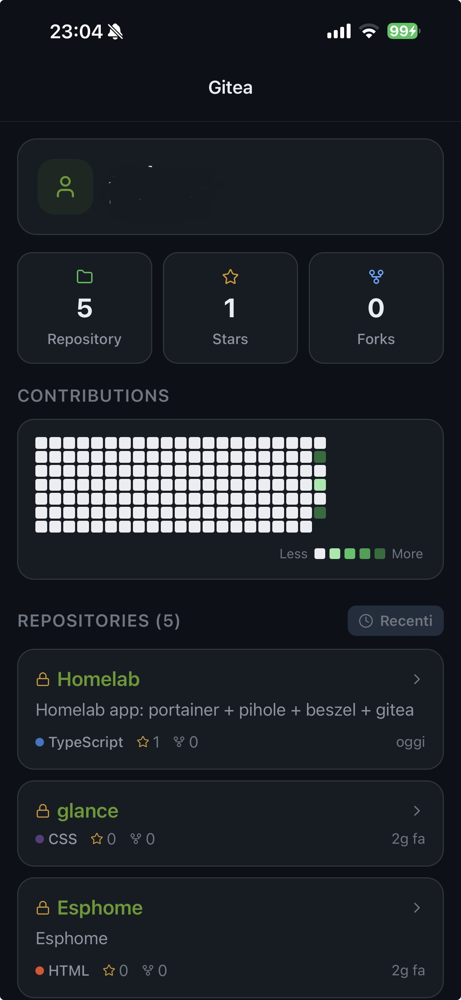

<div align="center">
  
  
  
  
  
  <br />
  
  
  
  
  
</div>

<br />

# 🏠 Homelab Dashboard App

*(🇮🇹 Trovate la versione in Italiano scorrendo in basso / Italian version below)*

A beautifully crafted, fully native iOS & Android dashboard for monitoring and managing your personal Homelab ecosystem. Built with a focus on premium aesthetics, this app seamlessly connects to your local services to provide real-time status updates and deep integrations.

## ✨ Core Features

- **Premium Glassmorphism UI**: High-end visual design utilizing authentic native iOS blur effects and custom liquid glass components that react beautifully to scrolling.
- **Dynamic Theming Ecosystem**: Full support for system-level Dark and Light modes, heavily inspired by the gorgeous [Catppuccin](https://github.com/catppuccin/catppuccin) color palettes, with meticulously calculated contrast ratios for readability.
- **Advanced Service Monitoring**: Ping and actively verify the status of your local services in real time. Configure individual status cards for your entire network stack (Proxmox, Pi-hole, Beszel, Duplicati, TrueNAS, etc.).
- **Smart Fallback URLs**: Configurable internal (Local IP) and external (Cloudflare Tunnels/DDNS) URLs that auto-switch based on your current network accessibility. If your Wireguard/Tailscale VPN drops, the app intelligently routes through your public endpoints seamlessly.
- **Native Gitea Integration**: Browse your Git repositories, check heatmap contribution activity, view latest commits, and read code files natively with full syntax highlighting. Includes customizable sorting (Recent / A-Z).
- **Portainer Integration**: Monitor your Docker node environments, view running containers, check resource limits, and instantly restart or stop containers directly from your pocket. Automatically handles CSRF tokens securely.
- **Pi-hole API Connectivity**: Monitor your DNS queries in real time, view blocked domains metrics, and temporarily disable tracking blocking (e.g., for 5 minutes) via quick action buttons.
- **Custom Animated Tab Bar**: A perfectly centered, floating glass pill tab bar equipped with satisfying physics-based spring animations for a fluid, tactile user experience.

## 🛠 Tech Stack

- **Framework**: [React Native](https://reactnative.dev) + [Expo Router](https://docs.expo.dev/router/introduction/)
- **State & Data Fetching**: `@tanstack/react-query`
- **UI Components**: `@callstack/liquid-glass` for native blur, `react-native-reanimated` for 60fps physics-based animations.
- **Storage**: `@react-native-async-storage/async-storage` for secure local configuration persistence.
- **Icons**: `lucide-react-native`

## 🚀 Getting Started

To run this project locally on your machine or deploy it to your device (via local Xcode build or AltStore):

### Prerequisites
- Node.js & Bun installed
- Xcode (for iOS builds) or Android Studio (for Android builds)
- A connected iPhone (for physical device testing)

### Installation

1. **Clone the repository:**
   ```bash
   git clone <YOUR_GIT_URL>
   cd Homelab
   ```

2. **Install dependencies:**
   ```bash
   bun i
   ```

3. **Run the development server:**
   ```bash
   bun run start
   ```

4. **Build native iOS App:**
   To build the `.ipa` for AltStore or install straight to your phone, open the `ios/Homelab.xcworkspace` in Xcode, select your device, and hit `Play` (Build).

## 🌍 Language Support
The app intuitively includes support for Italian (`it`) and English (`en`), with translation dictionaries configured locally.

## 📝 License
This project is meant for personal homelab use. Build, tweak, and enjoy your beautiful dashboard!

<br />
<hr />
<br />

# 🏠 App Dashboard Homelab (Italiano)

Una dashboard iOS e Android completamente nativa e curata nei minimi dettagli per monitorare e gestire il tuo ecosistema Homelab personale. Costruita con un'attenzione maniacale all'estetica premium, questa app si collega ai tuoi servizi locali per fornire aggiornamenti di stato in tempo reale e integrazioni profonde.

## ✨ Le Funzionalità Principali

- **UI Premium in stile Glassmorphism**: Design visivo di altissima qualità che sfrutta i veri effetti di sfocatura nativi di iOS e componenti personalizzati in "liquid glass" che reagiscono allo scorrimento della pagina.
- **Ecosistema di Temi Dinamici**: Pieno supporto per le modalità Chiaro e Scuro a livello di sistema, fortemente ispirato alle bellissime palette di colori [Catppuccin](https://github.com/catppuccin/catppuccin), con rapporti di contrasto calcolati minuziosamente.
- **Monitoraggio Avanzato dei Servizi**: "Pinga" e verifica attivamente lo stato dei tuoi servizi locali in tempo reale. Configura schede individuali per tutto il tuo stack di rete (Proxmox, Pi-hole, Beszel, Duplicati, TrueNAS, ecc.).
- **URL di Fallback Intelligenti**: URL interni (IP Locali) ed esterni (Cloudflare Tunnels/DDNS) configurabili che si scambiano automaticamente in base all'accessibilità attuale della rete. Se la tua VPN Wireguard/Tailscale cade, l'app indirizza intelligentemente il traffico sui tuoi endpoint pubblici in una frazione di secondo.
- **Integrazione Nativa Gitea**: Sfoglia i tuoi repository Git, controlla l'attività dei contributi nell'heatmap verde, visualizza gli ultimi commit e leggi i file di codice direttamente nell'app con l'evidenziazione completa della sintassi. Include anche l'ordinamento personalizzabile (Recenti / A-Z).
- **Integrazione Portainer**: Monitora i tuoi ambienti Docker, visualizza i container in esecuzione, controlla i limiti di risorse e riavvia o ferma istantaneamente i container direttamente dal tuo telefono. Gestisce in automatico anche i token di sicurezza CSRF crittografati.
- **Connettività API Pi-hole**: Monitora in tempo reale le tue query DNS, controlla le metriche dei domini bloccati e disabilita temporaneamente il blocco del tracciamento (es. per 5 minuti) tramite dei pratici pulsanti di azione rapida.
- **Tab Bar Animata Personalizzata**: Una barra di navigazione fluttuante a forma di pillola perfettamente centrata, dotata di animazioni a molla (spring) super fluide basate sulla fisica per un'esperienza utente tattile e appagante.

## 🛠 Tecnologie Utilizzate

- **Framework**: [React Native](https://reactnative.dev) + [Expo Router](https://docs.expo.dev/router/introduction/)
- **Gestione Dati & Stato**: `@tanstack/react-query`
- **Componenti Interfaccia**: `@callstack/liquid-glass` per la sfocatura nativa, `react-native-reanimated` per animazioni a 60fps basate sulla fisica.
- **Archiviazione Locale**: `@react-native-async-storage/async-storage` per il salvataggio sicuro e persistente delle credenziali e configurazioni.
- **Icone**: Vector icons di `lucide-react-native`

## 🚀 Come Iniziare

Per avviare questo progetto localmente sul tuo computer o compilarlo per il tuo dispositivo (tramite installazione locale via cavo su Xcode o generazione di .ipa per AltStore):

### Prerequisiti
- Node.js & Bun installati sul PC
- Xcode (per la generazione e compilazione iOS) o Android Studio (per Android)
- Un iPhone o iPad fisicamente collegati (per il testing nativo)

### Installazione passo dopo passo

1. **Clona la repository di codice:**
   ```bash
   git clone <INSERISCI_URL_GIT>
   cd Homelab
   ```

2. **Installa tutte le dipendenze software:**
   ```bash
   bun i
   ```

3. **Avvia il server di sviluppo in locale:**
   ```bash
   bun run start
   ```

4. **Compila l'applicazione nativa finale su iOS:**
   Per generare il file `.ipa` da inviare ad AltStore o per installare l'app direttamente sul tuo telefono permanentemente via cavo, apri il file `ios/Homelab.xcworkspace` in Xcode, seleziona in alto il tuo iPhone collegato (non il simulatore) e premi il pulsante `Play ▶️` (Build).

## 🌍 Lingue Supportate
L'app include un supporto logico e traduzioni sia in Italiano (`it`) che in Inglese (`en`). Leggerà la lingua impostata originariamente dal sistema operativo del tuo telefono e si adatterà da sola.

## 📝 Licenza
Questo progetto è stato creato per uso personale e amatoriale in ambiente homelab. Modificalo, costruiscici sopra e goditi la tua bellissima dashboard!
